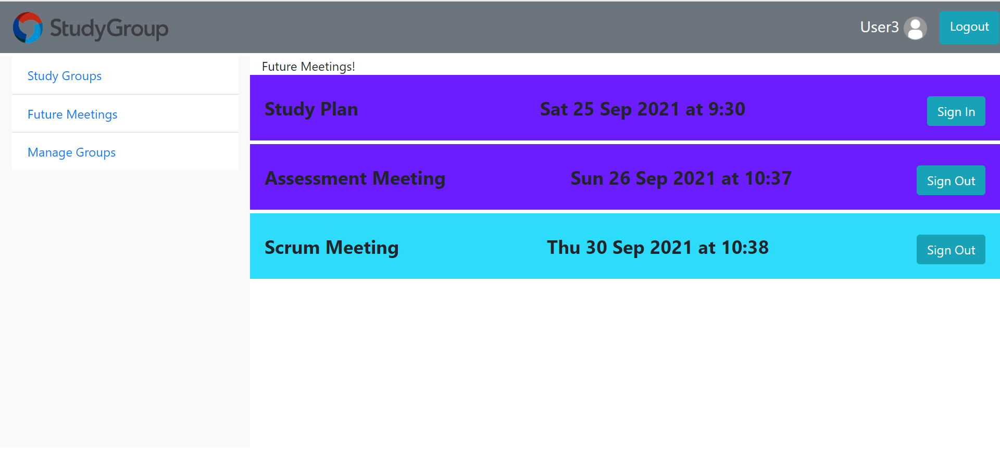

# Exam #3: "Study Groups"
## Student: s290482 MARCO CAPUSSO

## React Client Application Routes

- Route `/`: home page
- Route `/login`: login page
- Route `/studygroups`: page where all the available study groups are shown. The user can send a join request to the study groups he/she wants to join.
- Route `/meetings`: page where all the future meetings for all the joined study groups are joined.
- Route `/managegroups`: page with the list of groups the user is admin of. In this page the user has the possibility of managing the group members and the group meetings.
- Route `/administration`: in this page the general administrators are able to manage all the available study groups. The user is allowed to see the list of past and future meetings and to change the role of the members of a group. 
- Default route: will match anything else that is different from the previous ones and will show a 404 GIF

## API Server

### Perform login

**HTTP Method**: `POST` <br/>
**URL**: `/api/sessions` <br/>
**Description**: Perform login for a user with username (e-mail) and password <br/>
**Sample request**: <br/>
```http
POST http://localhost:3001/api/sessions
Content-Type: application/json

{
  "username": "marco@polito.it", 
  "password": "marcomarco"
}
```
```http
POST http://localhost:3001/api/sessions
Content-Type: application/json

{
  "username": "marco@polito.it", 
  "password": "passwrong"
}
```
**Sample response**: <br/>
```http
HTTP/1.1 200 OK
X-Powered-By: Express
Content-Type: application/json; charset=utf-8
Content-Length: 64
ETag: W/"40-RfLBBjlikySea9MswU6E+/y3RXM"
Set-Cookie: connect.sid=s%3Ahq9PiGc7k7ZfiZcvIBxxk40qs_XxhqPg.OjtI6RRtgBU70ntf3h%2BsfNEp%2F%2FYh3Hx6oghX7m8%2Fd3k; Path=/; HttpOnly; SameSite=Strict
Date: Sun, 04 Sep 2021 11:24:41 GMT
Connection: close

{
  "id": 1,
  "username": "marco@polito.it",
  "name": "Marco"
}
```
**Error response(s)**: <br/>
```http
HTTP/1.1 401 Unauthorized
X-Powered-By: Express
Content-Type: application/json; charset=utf-8
Content-Length: 49
ETag: W/"31-Zoymuc0GB5Y05HVb13yrtWLixv4"
Date: Sun, 04 Sep 2021 11:24:41 GMT
Connection: close

{
  "message": "Incorrect username and/or password."
}
```

### Check if the user is logged in or not

**HTTP Method**: `GET` <br/>
**URL**: `/api/sessions/current` <br/>
**Description**: Check if the user is logged in or not <br/>
**Sample request**: <br/>
```http
GET http://localhost:3001/api/sessions/current 
```
**Sample response**: <br/>
```http
HTTP/1.1 200 OK
X-Powered-By: Express
Content-Type: application/json; charset=utf-8
Content-Length: 64
ETag: W/"40-RfLBBjlikySea9MswU6E+/y3RXM"
Date: Sun, 04 Sep 2021 11:24:41 GMT
Connection: close

{
  "id": 1,
  "username": "marco@polito.it",
  "name": "Marco"
}
```
**Error response(s)**: <br/>
```http
HTTP/1.1 401 Unauthorized
X-Powered-By: Express
Content-Type: application/json; charset=utf-8
Content-Length: 33
ETag: W/"21-V8x1OYsvKEIKIAIW760m3YHzhZ0"
Date: Sun, 04 Sep 2021 11:24:41 GMT
Connection: close

{
  "error": "Unauthenticated user!"
}
```

### Perform logout

**HTTP Method**: `DELETE` <br/>
**URL**: `/api/sessions/current` <br/>
**Description**: Perform logout <br/>
**Sample request**: <br/>
```http
DELETE http://localhost:3001/api/sessions/current 
```
**Sample response**: <br/>
```http
HTTP/1.1 200 OK
X-Powered-By: Express
Date: Sun, 04 Sep 2021 11:24:41 GMT
Connection: close
Transfer-Encoding: chunked
```

###  Insert a new Study Group

**HTTP Method**: `POST` <br/>
**URL**: `/api/newGroup` <br/>
**Description**: Inserts a new study group into the database <br/>
**Sample request**: <br/>
```http
POST http://localhost:3001/api/newGroup
Content-Type: application/json

{
    "groupName": "Group A",
    "groupCourse": "Web Application",
    "color": "Blue",
    "credits": 6
}
```
**Sample response**: <br/>
```http
HTTP/1.1 201 Created
X-Powered-By: Express
Location: http://localhost:3001/api/newGroup
Content-Type: application/json; charset=utf-8
Content-Length: 103
ETag: W/"67-51BwmR0vYDZSql4daCYrB4kUQ0w"
Date: Sun, 04 Sep 2021 11:24:41 GMT
Connection: close

{
  status: "success"
}
```
**Error response(s)**: <br/>
```http
HTTP/1.1 401 Unauthorized
X-Powered-By: Express
Content-Type: application/json; charset=utf-8
Content-Length: 29
ETag: W/"1d-UanYH2PSt0KmMjFYYCxoQ9Lf+Ao"
Date: Sun, 04 Sep 2021 11:24:41 GMT
Connection: close

{
  "error": "not authenticated"
}
```

### Retrieve all the available groups for a user

**HTTP Method**: `GET` <br/>
**URL**: `/api/getAvailableGroups/:userId` <br/>
**Description**: Retrieve the list of all the available groups for a user<br/>
**Sample request**: <br/>
```http
GET http://localhost:3001/api/getAvailableGroups/1
```
**Sample response**: <br/>
```http
HTTP/1.1 200 OK
X-Powered-By: Express
Content-Type: application/json; charset=utf-8
Content-Length: 1365
ETag: W/"555-lf/WugXWr58ctz2NS0mOgyYLEj8"
Date: Sun, 04 Sep 2021 11:24:41 GMT
Connection: close

[
    {
        "groupId": 7,
        "groupName": "Group C",
        "course": "Computer Networks",
        "credits": 6,
        "color": "Green",
        "role": 0,
        "joined": 0,
        "requested": 0
    },
    {
        "groupId": 2,
        "groupName": "Group A",
        "course": "Machine Learning",
        "credits": 6,
        "color": "Lightblue",
        "role": 0,
        "joined": 0,
        "requested": 0
    },
    {
        "groupId": 3,
        "groupName": "Group B",
        "course": "Software Engineering",
        "credits": 8,
        "color": "Purpleblue",
        "role": 0,
        "joined": 0,
        "requested": 0
    }
]
```

### Create a new Meeting

**HTTP Method**: `POST` <br/>
**URL**: `/api/createMeeting` <br/>
**Description**: Create a new meeting for a specified group <br/>
**Sample requests**: <br/>
```http
POST http://localhost:3001/api/createMeeting
Content-Type: application/json

{
    "title": "Scrum Meeting",
    "description": "Brief meeting,
    "dateStart": "2021-09-26T08:37:59.000Z",
    "dateEnd": "2021-09-26T09:37:59.000Z",
    "groupId": 1,
    "duration": 60,
    "location": "Turin"
}
```
**Sample response**: <br/>
```http
HTTP/1.1 201 Created
X-Powered-By: Express
Location: http://localhost:3001/api/createMeeting
Content-Type: application/json; charset=utf-8
Content-Length: 103
ETag: W/"67-51BwmR0vYDZSql4daCYrB4kUQ0w"
Date: Sun, 04 Sep 2021 11:24:41 GMT
Connection: close

{
  "status" : "success
}
```
**Error response(s)**: <br/>
```http
HTTP/1.1 401 Unauthorized
X-Powered-By: Express
Content-Type: application/json; charset=utf-8
Content-Length: 29
ETag: W/"1d-UanYH2PSt0KmMjFYYCxoQ9Lf+Ao"
Date: Sun, 04 Sep 2021 11:24:41 GMT
Connection: close

{
  "error": "not authenticated"
}
```

### Remove user from group

**HTTP Method**: `DELETE` <br/>
**URL**: `/api/removeUserFromGroup` <br/>
**Description**: Delete a certain user from a given group<br/>
**Sample requests**: <br/>
```http
DELETE http://localhost:3001/api/removeUserFromGroup

{
  userId: 1,
  groupId: 2
}
```
**Sample response**: <br/>
```http
HTTP/1.1 200 OK
X-Powered-By: Express
Content-Type: application/json; charset=utf-8
Content-Length: 51
ETag: W/"33-62VNW2nzI85+iVgQCsYLcSaF4GY"
Date: Sun, 04 Sep 2021 11:24:41 GMT
Connection: close

{
  "outcome": "success"
}
```
**Error response(s)**: <br/>
```http
HTTP/1.1 401 Unauthorized
X-Powered-By: Express
Content-Type: application/json; charset=utf-8
Content-Length: 29
ETag: W/"1d-UanYH2PSt0KmMjFYYCxoQ9Lf+Ao"
Date: Sun, 04 Sep 2021 11:24:41 GMT
Connection: close

{
  "error": "not authenticated"
}
```

### Retrieve all the members of each group

**HTTP Method**: `GET` <br/>
**URL**: `/api/getGroupsMembers` <br/>
**Description**: Retrieve the list of all the members for each group <br/>
**Sample request**: <br/>
```http
GET http://localhost:3001/api/getGroupsMembers
```
**Sample response**: <br/>
```http
HTTP/1.1 200 OK
X-Powered-By: Express
Content-Type: application/json; charset=utf-8
Content-Length: 520
ETag: W/"208-L+nYsm4Q60QPy31vP4xdN0IZQXw"
Date: Sun, 04 Sep 2021 11:24:41 GMT
Connection: close

{
    "2": [
        {
            "groupId": 2,
            "userId": 2,
            "role": 1,
            "name": "User2",
            "email": "dummy@polito.it"
        },
        {
            "groupId": 2,
            "userId": 3,
            "role": 1,
            "name": "User3",
            "email": "marco@polito.it"
        }
    ],
    "3": [
        {
            "groupId": 3,
            "userId": 3,
            "role": 1,
            "name": "User3",
            "email": "marco@polito.it"
        },
        {
            "groupId": 3,
            "userId": 4,
            "role": 1,
            "name": "User4",
            "email": "paolo@polito.it"
        }
    ]
}
```
**Error response(s)**: <br/>
```http
HTTP/1.1 401 Unauthorized
X-Powered-By: Express
Content-Type: application/json; charset=utf-8
Content-Length: 29
ETag: W/"1d-UanYH2PSt0KmMjFYYCxoQ9Lf+Ao"
Date: Sun, 04 Sep 2021 11:24:41 GMT
Connection: close

{
  "error": "not authenticated"
}
```

### Retrieve all the meetings

**HTTP Method**: `GET` <br/>
**URL**: `/api/getAllMeetings` <br/>
**Description**: Retrieve the list of all the meetings <br/>
**Sample request**: <br/>
```http
GET http://localhost:3001/api/getAllMeetings
```
**Sample response**: <br/>
```http
HTTP/1.1 200 OK
X-Powered-By: Express
Content-Type: application/json; charset=utf-8
Content-Length: 520
ETag: W/"208-L+nYsm4Q60QPy31vP4xdN0IZQXw"
Date: Sun, 04 Sep 2021 11:24:41 GMT
Connection: close

{
    "2": [
        {
            "meetingId": 8,
            "dateStart": "2021-09-30T08:38:36.000Z",
            "title": "Scrum Meeting",
            "groupId": 2,
            "location": "Home",
            "duration": 50,
            "color": "Lightblue"
        }
    ],
    "3": [
        {
            "meetingId": 5,
            "dateStart": "2021-09-03T07:30:00.000Z",
            "title": "Scrum Meeting",
            "groupId": 3,
            "location": "Turin",
            "duration": 30,
            "color": "Purpleblue"
        },
        {
            "meetingId": 6,
            "dateStart": "2021-09-25T07:30:00.000Z",
            "title": "Study Plan",
            "groupId": 3,
            "location": "Turin",
            "duration": 30,
            "color": "Purpleblue"
        },
        {
            "meetingId": 7,
            "dateStart": "2021-09-26T08:37:59.000Z",
            "title": "Assessment Meeting",
            "groupId": 3,
            "location": "Home",
            "duration": 60,
            "color": "Purpleblue"
        }
    ]
}
```
**Error response(s)**: <br/>
```http
HTTP/1.1 401 Unauthorized
X-Powered-By: Express
Content-Type: application/json; charset=utf-8
Content-Length: 29
ETag: W/"1d-UanYH2PSt0KmMjFYYCxoQ9Lf+Ao"
Date: Sun, 04 Sep 2021 11:24:41 GMT
Connection: close

{
  "error": "not authenticated"
}
```

## Database Tables
PK = Primary Key  
FK = Foreign Key
- Table `users` - contains id (PK), email, name, hash, admin.
- Table `meetings` - contains meetingId (PK), dateStart, dateEnd, title, description, location, duration, groupId (FK).
- Table `studygroups` - contains groupId (PK), groupName, groupCourse, credits, color.
- Table `useringroup` - uigId (PK), userId (FK), groupId (FK), role.
- Table `meetingpartecipants` - partecipationId (PK), userId(FK), meetingId(FK).
- Table `joinrequests` - requestId (PK), userId(FK), groupId(FK).

## Main React Components

- `NavBar` (in `Navbar.js`): component used to manage the navbar. It allows performing the logout and go to the login page
- `Administration`: shows the page accessible only to administrators. In that page it is possible to manage the various groups and to see the meetings and members of each group.
- `ManageGroup` (in `ManageGroup.js`): shows the page accessible to all group administrators. Each group administrator can manage the groups he/she is admin of.
- `Meetings` (in `Meetings.js`): in this component each user can see the list of future meetings for all the joined groups. Furthermore it is possible to sign in for those meetings.
- `LoginForm` (in `Login.js`): component for the login form
- `StudyGroups` (in `StudyGroups.js`): component used to show all the available study groups in the system.
- `ModalMeetings` (in `ModalMeetings.js`): component used to show all the past/future meetings in the ManageGroup page. It also makes it possible to create new meetings.
- `ModalMembers` (in `ModalMembers.js`): component used to show all the members of a group in the Manage Group section. It also allows the user to accept pending join requests.
- `ModalCreate` (in `ModalCreate.js`): component user to create a new study group.

## Screenshot



## Users Credentials

| Username (e-mail) | Password |
| :------------- |:-------------|
|admin@polito.it | administrator |
|dummy@polito.it | dummydummy |
|marco@polito.it | marcomarco |
|paolo@polito.it | paolopaolo |
|luca@polito.it | lucaluca |

